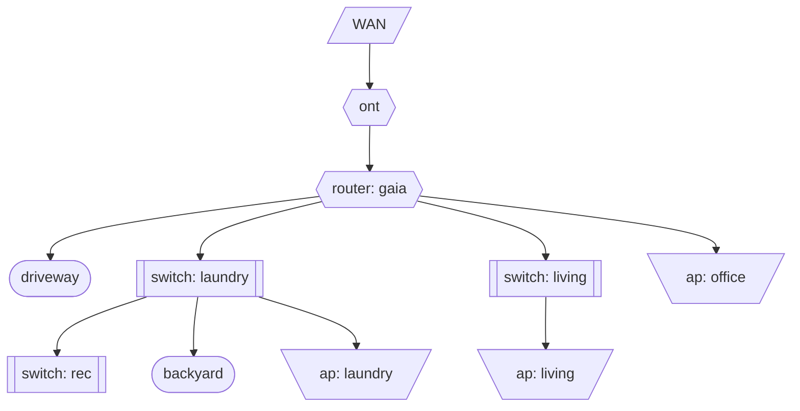

# Network Planning

## Network Diagram

```mermaid
graph TD;
    wan[/WAN/]
    ont{{ont}}
    gaia{{router: gaia}}
    cam-driveway([driveway])
    cam-backyard([backyard])
    sw-laundry[[switch: laundry]]
    sw-rec[[switch: rec]]
    sw-living[[switch: living]]
    ap-office[\ap: office/]
    ap-living[\ap: living/]
    ap-laundry[\ap: laundry/]
    wan --> ont
    ont --> gaia
    gaia --> cam-driveway
    gaia --> sw-laundry
    gaia --> ap-office
    sw-laundry --> sw-rec
    sw-laundry --> cam-backyard
    sw-laundry --> ap-laundry
    gaia --> sw-living
    sw-living --> ap-living
```